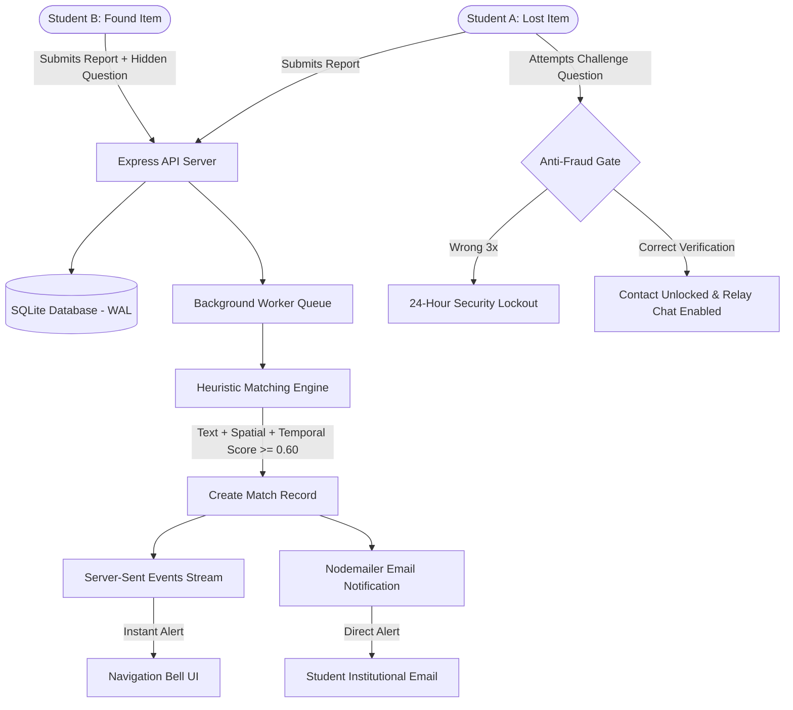

# 🔍 Campus Lost & Found — Privacy-First Intelligent Recovery Platform

[](https://opensource.org/licenses/MIT)
[](https://nodejs.org/)
[](https://expressjs.com/)
[](https://react.dev/)
[](https://vitejs.dev/)
[](https://tailwindcss.com/)
[](https://sqlite.org/)

> **A production-ready, intelligent web application designed for university campuses to report, match, and safely recover lost belongings without compromising personal privacy.**

---

## 🌟 Overview & Key Innovations

Standard campus lost-and-found boards suffer from two major flaws: **fraudulent claims** (strangers claiming items they do not own) and **privacy leaks** (publicly broadcasting students' personal phone numbers and emails). 

**Campus Lost & Found** solves this with an intelligent, privacy-preserving architecture:

1. **🛡️ Zero-Knowledge Anti-Fraud Security Firewall**
   - Finders define a hidden verification challenge question (e.g., *"What sticker is on the laptop lid?"*, *"What brand are the earphones inside?"*).
   - Finder contact details (`phone`, `email`) remain completely encrypted and hidden from API responses.
   - Contact info is only unlocked once the claimant provides the exact matching answer.
   - **Brute-Force Shield:** Claimants are restricted to 3 attempts. Upon 3 failed attempts, a 24-hour security lockout is automatically enforced.

2. **🧠 Multi-Factor Heuristic Matching Engine**
   - An automated matching engine compares new posts across 4 weighted dimensions:
     $$\text{Confidence Score} = 0.40 \times \text{Text} + 0.20 \times \text{Color} + 0.25 \times \text{Location} + 0.15 \times \text{Time}$$
   - **Text Similarity:** Jaccard token set intersection with campus synonym expansion (*"buds"* $\to$ *"earphones"*, *"laptop charger"* $\to$ *"power adapter"*).
   - **Spatial Adjacency:** Graph-based campus building adjacency calculation (adjacent blocks receive partial credit; exact matches receive full credit).
   - **Temporal Decay:** Time-difference penalty with exponential decay over a 48-hour window.

3. **⚡ Real-Time Push Notifications (Server-Sent Events - SSE)**
   - High-confidence match alerts are streamed in real time to the student's navigation bell via HTTP Server-Sent Events (`/api/notifications/stream`) without continuous polling overhead.

4. **💬 Double-Blind Anonymous Relay Chat**
   - Students can communicate directly through an in-app relay channel without disclosing phone numbers or social media handles until both parties feel safe.

5. **🎨 Modern Glassmorphic UI / UX**
   - Built with React 18 and Tailwind CSS featuring dynamic color badges, skeleton loaders, subtle micro-animations, accessible contrast ratios, and mobile-first responsiveness.

---

## 🏗️ System Architecture



---

## 🛠️ Tech Stack

| Domain | Technology | Purpose |
| :--- | :--- | :--- |
| **Frontend** | React 18, Vite 5 | Reactive SPA with lightning-fast HMR and optimized production bundles |
| **Styling** | Tailwind CSS 3.4, Lucide Icons | Responsive glassmorphic design system and micro-animations |
| **Forms & Validation** | React Hook Form, Zod | Strict client-side validation schema enforcement |
| **Routing** | React Router v6 | Client-side routing with protected authenticated routes |
| **Backend** | Node.js (ESM), Express 5 | RESTful API server with asynchronous request lifecycle |
| **Database** | SQLite (`better-sqlite3` / `node:sqlite`) | High-performance ACID storage with Write-Ahead Logging (WAL) |
| **Security** | JWT, bcryptjs, express-rate-limit | Secure authentication, salted hashing, and DoS mitigation |
| **File Processing** | Multer, Sharp | Secure image upload handling, validation, and compression |
| **Alerts & Messaging** | Server-Sent Events (SSE), Nodemailer | Real-time push updates and automated transactional notifications |

---

## 📁 Repository Structure

```
lost_and_found/
├── .vscode/                     # Workspace configuration & CSS linter settings
├── backend/                     # Express REST API Server
│   ├── src/
│   │   ├── app.js               # Express application configuration & middleware
│   │   ├── config/
│   │   │   ├── db.js            # SQLite database schema, triggers, and indices
│   │   │   └── constants.js     # Campus locations, adjacency matrix & synonym rules
│   │   ├── controllers/         # Business logic handlers
│   │   │   ├── authController.js
│   │   │   ├── lostController.js
│   │   │   ├── foundController.js
│   │   │   ├── matchController.js
│   │   │   ├── notificationController.js
│   │   │   ├── chatController.js
│   │   │   └── reportController.js
│   │   ├── middleware/          # JWT auth, rate limiters, upload filters
│   │   ├── routes/              # Modular API route definitions
│   │   └── services/            # Matching algorithm, background worker, emailer
│   ├── server.js                # Server entry point (Port 5000)
│   ├── package.json
│   └── .env.example
├── frontend/                    # Vite + React Client Application
│   ├── src/
│   │   ├── api/                 # Axios/Fetch API client and request interceptors
│   │   ├── auth/                # AuthContext and persistent token state
│   │   ├── components/          # Reusable UI components (Navbar, MatchCard, etc.)
│   │   ├── pages/               # Application pages (Home, Matches, Forms, Detail)
│   │   ├── App.jsx              # Main routing tree
│   │   ├── main.jsx             # Entry mount point
│   │   └── index.css            # Tailwind directives and custom animation tokens
│   ├── package.json
│   └── vite.config.js
├── LICENSE                      # MIT Open Source License
└── README.md                    # Project documentation
```

---

## 🚀 Getting Started

### Prerequisites
- **Node.js**: `v18.0.0` or higher installed
- **npm**: `v9.0.0` or higher

### 1. Clone the Repository
```bash
git clone https://github.com/Srivel33/lost_and_found.git
cd lost_and_found
```

### 2. Configure & Start the Backend
```bash
cd backend
npm install

# Copy environment template
cp .env.example .env
```

Ensure your `backend/.env` file contains your configuration:
```env
PORT=5000
JWT_SECRET=your_super_secret_jwt_key_here
NODE_ENV=development
CLIENT_URL=http://localhost:5173

# Optional: Email Notifications (uses Ethereal test inbox by default if empty)
SMTP_HOST=smtp.gmail.com
SMTP_PORT=587
SMTP_USER=your_email@gmail.com
SMTP_PASS=your_app_password
```

Start the backend in development mode:
```bash
npm run dev
# Backend starts on http://localhost:5000
```

### 3. Configure & Start the Frontend
Open a new terminal window:
```bash
cd frontend
npm install

# Start the Vite development server
npm run dev
# Frontend runs on http://localhost:5173
```

Visit **`http://localhost:5173`** in your browser.

---

## 📡 API Endpoints

### Authentication
| Method | Endpoint | Description |
| :--- | :--- | :--- |
| `POST` | `/api/auth/register` | Register new student account |
| `POST` | `/api/auth/login` | Authenticate user & receive JWT token |
| `GET` | `/api/auth/me` | Fetch authenticated student profile |
| `POST` | `/api/auth/demo-reset` | Reset demo seed accounts for testing |

### Lost & Found Items
| Method | Endpoint | Description |
| :--- | :--- | :--- |
| `GET` | `/api/lost` | Query all active lost item postings |
| `POST` | `/api/lost` | Submit a new lost item report |
| `GET` | `/api/found` | Query all active found item postings |
| `POST` | `/api/found` | Submit a new found item with security question |
| `PUT` | `/api/lost/:id/resolve` | Mark item as resolved/returned |

### Intelligent Matching & Anti-Fraud
| Method | Endpoint | Description |
| :--- | :--- | :--- |
| `GET` | `/api/matches` | Get matches associated with current user's posts |
| `GET` | `/api/matches/:id` | Get match details (hides finder contact info) |
| `POST` | `/api/matches/:id/verify` | Submit answer to security question |
| `GET` | `/api/matches/:id/contact` | Retrieve unlocked contact info upon verification |

### Real-Time & Chat
| Method | Endpoint | Description |
| :--- | :--- | :--- |
| `GET` | `/api/notifications` | Fetch user alerts |
| `GET` | `/api/notifications/stream` | Server-Sent Events stream for real-time alerts |
| `GET` | `/api/chat/:matchId` | Fetch message history for a match |
| `POST` | `/api/chat/:matchId` | Send double-blind message |

---

## 🔒 Security & Privacy Practices

- **Zero Exposure of Finder Data**: Finder credentials (`finderPhone`, `finderEmail`) and the hidden question answer are stripped from query results at the database controller level.
- **Lockout Mechanism**: Prevents automated dictionary attacks against security questions by enforcing a 24-hour lockout after 3 consecutive incorrect attempts.
- **Rate Limiting**: Sliding window rate limits prevent DoS attacks on `/api/auth/login` and `/api/matches/:id/verify`.
- **Content Safety**: Uploaded images are restricted to JPEG/PNG/WebP, validated by MIME headers and size-capped to prevent buffer overflow attacks.

---

## 🤝 Contributing

Contributions make the open-source community an incredible place to learn, inspire, and create:

1. **Fork** the Project
2. Create your Feature Branch (`git checkout -b feature/AmazingFeature`)
3. Commit your Changes (`git commit -m 'feat: Add some AmazingFeature'`)
4. Push to the Branch (`git push origin feature/AmazingFeature`)
5. Open a **Pull Request**

---

## 📄 License

Distributed under the **MIT License**. See [`LICENSE`](./LICENSE) for more information.

---

## 👨‍💻 Author

**Srivel T**
- GitHub: [@Srivel33](https://github.com/Srivel33)
- Email: srivel603@gmail.com
